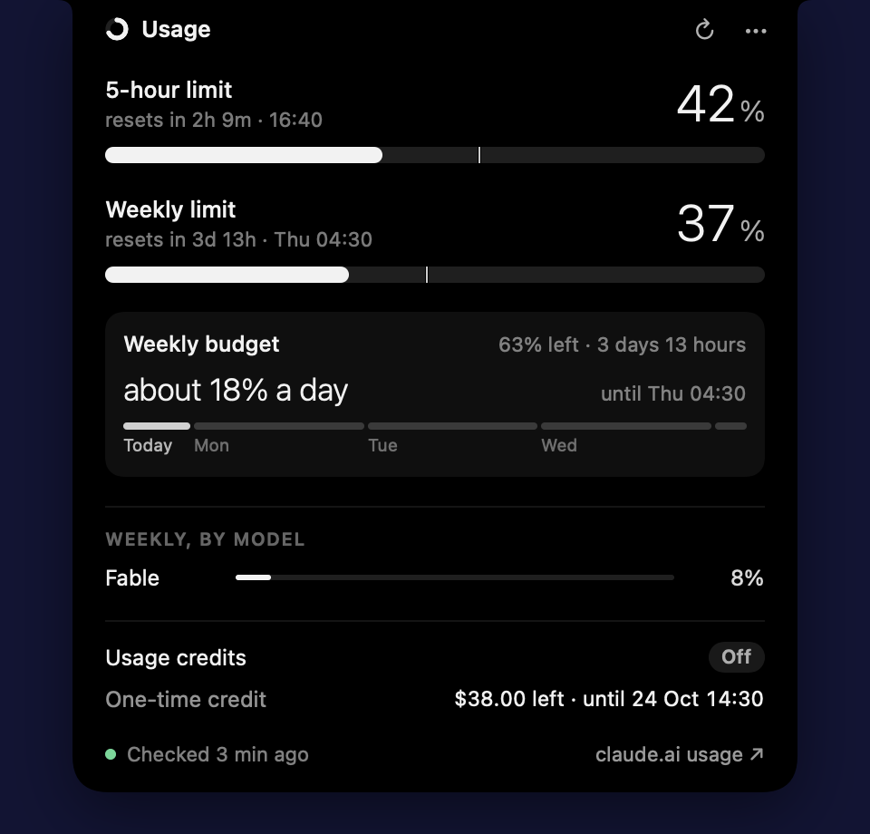

# Hourglass

A native macOS notch app that shows your live Claude usage: the 5-hour limit and the weekly limit,
with a reset countdown, a daily budget for the rest of your week and how old the reading is.

It gets the numbers by asking your own installed Claude Code: the app launches `claude` hidden,
sends it a `get_usage` request, reads the answer and lets it exit. Claude Code makes the network
call with its own login. The app never reads your Claude login, the Keychain or claude.ai cookies,
and never calls Anthropic itself.

> **Experimental interface.** `get_usage` is not a documented API. Claude Code marks it as
> experimental, and any Claude Code update can change or remove it. When that happens the app
> falls back to `claude -p "/usage"`, and if that also changes, the notch shows the last reading
> with its age rather than wrong numbers. Expect to update the app when Claude Code changes.

Most of the time it sits beside the notch like this: two rings on the left for the 5-hour and
weekly limits, and the time until the 5-hour reset on the right.


Hover for a quick look, or click to open the full view:



## What it shows

| State | How you get there | What you see |
| --- | --- | --- |
| At rest | Always on, beside the notch | Left of the notch, two rings: the outer one is the 5-hour limit, the inner one the weekly limit. Right of it, the time until the 5-hour reset ("50m", "2h09"). 36 pt each side and nothing below the notch. The outer ring turns amber from 75% and red from 90%; everything goes grey once the reading is over 30 minutes old, and the right side shows a green "Ready" when no 5-hour window is open. |
| Peek | Hover over the notch for a quarter of a second | 5-hour and weekly percentages in large numerals, reset times, and when the numbers were last checked. Each limit has a bar: the fill is how much you've used, the tick is how much of the window's time has passed, so a fill past the tick means you're using it faster than an even pace. Hovering never triggers a read. |
| Expanded | Click the notch | Both limits as bars with the same time-elapsed tick, a warning if you'll hit a limit before it resets at your current rate, and a weekly budget card: what's left of the weekly limit spread over the remaining days ("about 18% a day", or "N% left until reset" when under a day remains), with a strip of those days. Below that, per-model weekly limits (such as Fable), usage credits on or off with this month's spend, any promotional credit, and a link to claude.ai's usage page. A window with no open period shows "Ready", not 0%. |
| Alert | Crossing 75%, 90% or 100%, or a limit resetting | A brief drop-down, once per threshold per window. |
| Refresh | The ↻ button in the expanded view, or **Refresh now** in its menu | Asks Claude Code for fresh numbers, within the read budget (see below). |

Without a notch (lid closed on an external display, or an older Mac) it becomes a small menu bar
item with the same expanded view in a popover.

While a video plays (any app asking macOS to keep the display awake, such as a browser playing
YouTube or Stremio), the resting indicators fade out and come back 3 seconds after it stops.
Hover still works, and alerts wait until the video ends. **Hide for 1 hour** in the ••• menu does
the same by hand.

## How the data gets there

Each read launches `~/.local/bin/claude` once, hardened:

- `--safe-mode --strict-mcp-config --no-session-persistence` and settings that turn off hooks,
  Remote Control and session upload, so no hooks, MCP servers or saved sessions;
- an environment built from scratch (`HOME`, `USER`, `LOGNAME`, `PATH`, `TMPDIR`, `LANG`,
  `DISABLE_AUTOUPDATER=1`) and an empty temporary working folder;
- `get_usage` with `skip_behaviors`, which makes no model turn and costs nothing. If a Claude Code
  version doesn't answer it, the app falls back to `claude -p "/usage"`.

A read takes about 2 seconds and 200 MB while it runs. Only one runs at a time, it gets SIGTERM
after 40 seconds and is never force-killed, and no read starts while Claude Code is refreshing its
login (`~/.claude/.oauth_refresh.lock`).

When it reads:

| Trigger | Reads? |
| --- | --- |
| Hover | Never. Shows the cached numbers and their age. |
| Expand (click) | If the numbers are over 2 minutes old. |
| ↻ | Yes, unless a read finished in the last minute ("Up to date · checked 25s ago"). |
| Background | Every 15 minutes while you're using the Mac, every 10 at 70% or when usage is rising fast. Paused while asleep, locked or idle for 5 minutes. |

All triggers share one budget: at most 10 reads an hour, at most 6 of them in the background. If
Claude Code returns last-known data or hits the usage server's rate limit, reads back off (saved
across relaunches) and the notch says "Next refresh in N min". After a limit is reached it stays
quiet for 3 minutes. The latest reading and the read ledger live in
`~/Library/Application Support/Hourglass/` (`plan-usage.json`, `read-ledger.json`).

## Build and install

Requires macOS 14 or later and Xcode (Swift 6).

```bash
scripts/build-app.sh --install
```

This builds `build/Hourglass.app`, copies it to `/Applications` and launches it. On first launch
it turns on launch at login.

```bash
swift test
```

runs the data-layer tests (parsing, merge rules, pace, staleness, alerts, settings editing).

## The legacy status line bridge

`Sources/Bridge` is a small status line command from an earlier design that read usage through
Claude Code's status line. The app no longer uses it and never connects it on its own. If you
connect it by hand (`hourglass-bridge --connect`), it changes only the `statusLine` entry in
`~/.claude/settings.json`, after backing the whole file up to
`~/Library/Application Support/Hourglass/backups/`, and `--disconnect` restores the original
entry exactly.

## Screenshots

See `screenshots/`: at rest, at rest while a video plays, peek (hover), open (click) and an alert,
rendered from a made-up reading with `Hourglass --render-previews <folder>`.

## Layout

- `Sources/UsageCore`: models, the merge rules, pace, staleness and weekly budget maths, alerts, and the
  settings installer. Foundation only, fully unit tested.
- `Sources/Bridge`: the status line command.
- `Sources/Hourglass`: the app (SwiftUI and AppKit).
- The notch panel is a plain `NSPanel` (`NotchPanel.swift`). `NotchShape` is adapted from
  [DynamicNotchKit](https://github.com/MrKai77/DynamicNotchKit) (MIT).

## Limits

- `get_usage` is marked experimental in Claude Code and may change; the parser treats every field
  as optional and the `/usage` fallback covers a missing request.
- Chat and Cowork usage shows up at the next read, so it can lag by up to the background interval.

## Licence

MIT, see [LICENSE](LICENSE). `NotchShape` is adapted from DynamicNotchKit (MIT); its licence is in
[THIRD_PARTY_NOTICES.md](THIRD_PARTY_NOTICES.md).

Not affiliated with or endorsed by Anthropic. Claude and Claude Code are trademarks of Anthropic.
